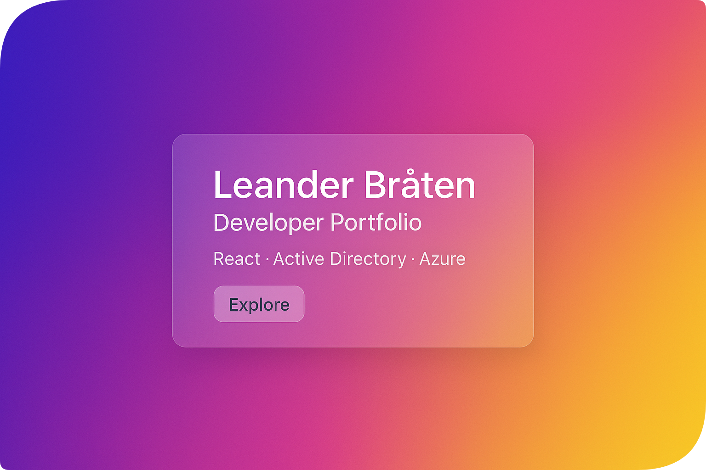

<h1 align="center">
    
</h1>

  

  
    <strong>
      
      Click on the banner to visit the portfolio!
        
    </strong>
  

#
<picture>
    <source media="(prefers-color-scheme: dark)" srcset="https://raw.githubusercontent.com/londer1/londer1/output/pacman-contribution-graph-dark.svg">
    <source media="(prefers-color-scheme: light)" srcset="https://raw.githubusercontent.com/londer1/londer1/output/pacman-contribution-graph.svg">
    
</picture>
 

#

  

<ul>
  <li>Building an AI in Copilot Studio to analyze and summarize science reports</li>
  <li>Developing my portfolio with React + Astro</li>
  <li>Government IT apprentice focused on growing in tech</li>
  <li>Click <a href="https://lbraten.github.io/" target="_blank">here</a> to visit my portfolio to read more</li>
</ul>
 

  
  <source media="(prefers-color-scheme: dark)" srcset="https://raw.githubusercontent.com/londer1/profile-readme-generator/main/public/assets/pacman-darksrcset="https://raw.githubusercontent.com/londer1/profile-readme-generator/main/public/assets/phttps://raw.githubusercontent.com/londer1/profile-readme-generator/main/public/assets
</picture>

 

  

  

#

 

  

